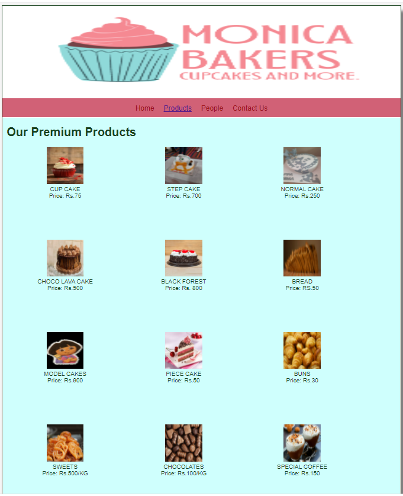

# Web Design for a Software Product Company

## AIM:

To design a static website for a software product company company.

## DESIGN STEPS:

### Step 1:

Requirement collection.

### Step 2:

Creating the layout using HTML and CSS.

### Step 3:

Updating the sample content.

### Step 4:

Choose the appropriate style and color scheme.

### Step 5:

Validate the layout in various browsers.

### Step 6:

Validate the HTML code.

### Step 7:

Publish the website in the given URL.

## PROGRAM :
LAYOUT CSS
```
* {
  box-sizing: border-box;
  font-family: Arial, Helvetica, sans-serif;
}
body {
  background-color: whitesmoke;
  color: #17421d;
}
.container {
  width: 1080px;
  margin-left: auto;
  margin-right: auto;
  border-width: 1px 1px 1px 1px;
  border-style: solid;
  box-shadow: 15px 15px 8px gray;
}

.banner {
  display: block;
  width: 100%;
  height: 250px;
  text-align: center;
  font-size: 60px;
  background-image: url("/static/img/MONICA BAKERS.png");
  background-size: 100% 100%;
  margin: 0px 0px 0px 0px;
  padding-top: 150px;
  color:blue;
}

.menu {
  display: block;
  width: 100%;
  height: 50px;
  font-size: larger;
  background-color: #D16176;
  text-align: center;
  padding-top: 15px;
  margin: 0px 0px 0px 0px;
  border-width: 1px;
}

.menuitem {
  display: inline-block;
  margin-left: 10px;
  margin-right: 10px;
}
.menuitemselected {
  display: inline-block;
  margin-left: 10px;
  margin-right: 10px;
  color: #16d1ae;
}

.menuitem a {
  text-decoration: none;
  color: #9c1018;
}

.content {
  display: block;
  width: 100%;
  background-color: #cffffd;
  min-height: 500px;
  margin: 0px 0px 0px 0px;
  border-width: 1px;
  border-color: white;
  border-style: solid;
}
.homecontent {
  min-height: 500px;
  margin: 10px 10px 10px 10px;
}
.homecontent h1 {
  text-align: left;
}
.homecontent img {
  float: right;
  width: 400px;
  height: 300px;
  margin-left: 10px;
}

.contenttext {
  text-align: justify;
}

.productcontent {
  min-height: 500px;
  margin: 10px 10px 10px 10px;
}

.productcontent h1 {
  text-align: left;
}

.productitems {
  display: block;
}

.productitem {
  display: inline-block;
  width: 30%;
  height: 250px;
  text-align: center;
}

.productitem img {
  width: 100px;
  height: 100px;
  display: block;
}
.productitem .itemimage {
  display: block;
  margin-left: auto;
  margin-right: auto;
  width: 100px;
  margin-bottom: 5px;
}

.productitem .itemname {
  display: block;
}
.productitem .itemprice {
  display: block;
}

.footer {
  display: block;
  width: 100%;
  height: 40px;
  background-color: #D16176;
  text-align: center;
  padding-top: 10px;
  margin: 0px 0px 0px 0px;
  color: #9c1018;
}
```
HOME PAGE
```
<!DOCTYPE html>
<html lang="en">
  <head>
    <title>jeeva company</title>
    <link rel="stylesheet" href="./css/layout.css" />
    <link rel="icon" href="./img/icon.png" type="image/x-icon" />
  </head>

  <body>
    <div class="container">
      <div class="banner"></div>
      <div class="menu">
        <div class="menuitemselected"><a href="/static/home.html">Home</a></div>
        <div class="menuitem"><a href="/static/products.html">Products</a></div>
        <div class="menuitem"><a href="/static/people.html">People</a></div>
        <div class="menuitem"><a href="/static/contactus.html">Contact Us</a></div>
      </div>
      <div class="content">
        <div class="homecontent">
          <h1>About Us</h1>
          
          <div class="contenttext">
            MONICA BAKERY is one of only a handful few enduring Craft Bakeries in rameswaram
            island.
            We have assembled our notoriety on consolidating great quality conventional
            heating with a great incentive for cash.
            <br>
            We offer our clients a full scope of bread, forte bread, morning merchandise,
            cakes, and baked goods.
            <br>
            Our bread is heated day by day at our pastry shop in rameswaram and is conveyed
            to our new branch in ramnad too.
            We utilize profoundly gifted specialty dough punchers to guarantee each portion
            of bread is flawless without fail.
            <br>
            Our pastry specialists work during that time with the goal that the portion of 
            bread you purchase toward the beginning of the day is crisp out of the stove!
            <br>
            avalible productitems
            <ul>
              <li>CUP CAKE (BEST SELLER)</li>
              <li>BIRTHDAY CAKES</li>
              <li>SWEETS</li>
              <li>BREADS,etc</li>
            </ul>
            <marquee behavior="scroll" direction="left"><h2>---**HOME DELIVERY AVAILABLE**---</h2></marquee>
          </div>
        </div>
      </div>
      <div class="footer">
        Copyright &#169; 2021 bakers ltd, Developed by:Jeeva Abishake.
      </div>
    </div>
  </body>
</html>
```
PRODUCT PAGE
```
<!DOCTYPE html>
<html lang="en">
  <head>
    <title>jeeva company</title>
    <link rel="stylesheet" href="./css/layout.css" />
    <link rel="icon" href="./img/icon.png" type="image/x-icon" />
  </head>

  <body>
    <div class="container">
      <div class="banner"></div>
      <div class="menu">
        <div class="menuitem"><a href="/static/home.html">Home</a></div>
        <div class="menuitemselected">
          <a href="/static/products.html">Products</a>
        </div>
        <div class="menuitem"><a href="/static/people.html">People</a></div>
        <div class="menuitem"><a href="/static/contactus.html">Contact Us</a></div>
      </div>
      <div class="content">
        <div class="productcontent">    
          <h1>Our Premium Products</h1>
          <div class="productitems">
              <div class="productitem"> 
                  <div class="itemimage">
                  
                  </div>
                  <div class="itemname">CUP CAKE</div>
                  <div class="itemprice">Price: Rs.75 </div>
              </div>
              <div class="productitem"> 
                  <div class="itemimage">
                  
                  </div>
                  <div class="itemname">STEP CAKE</div>
                  <div class="itemprice">Price: Rs.700 </div>
              </div>
              <div class="productitem"> 
                <div class="itemimage">
                
                </div>
                <div class="itemname">NORMAL CAKE</div>
                <div class="itemprice">Price: Rs.250 </div>
            </div>
            <div class="productitem"> 
              <div class="itemimage">
              
              </div>
              <div class="itemname">CHOCO LAVA CAKE</div>
              <div class="itemprice">Price: Rs.500</div>
          </div>
          <div class="productitem"> 
            <div class="itemimage">
            
            </div>
            <div class="itemname">BLACK FOREST</div>
            <div class="itemprice">Price: Rs. 800</div>
        </div>
        <div class="productitem"> 
          <div class="itemimage">
          
          </div>
          <div class="itemname">BREAD</div>
          <div class="itemprice">Price: RS.50 </div>
      </div>
      <div class="productitem"> 
        <div class="itemimage">
        
        </div>
        <div class="itemname">MODEL CAKES</div>
        <div class="itemprice">Price: Rs.900 </div>
    </div>
    <div class="productitem"> 
      <div class="itemimage">
      
      </div>
      <div class="itemname">PIECE CAKE</div>
      <div class="itemprice">Price: Rs.50 </div>
  </div>
  <div class="productitem"> 
    <div class="itemimage">
    
    </div>
    <div class="itemname">BUNS</div>
    <div class="itemprice">Price: Rs.30 </div>
</div>
<div class="productitem"> 
  <div class="itemimage">
  
  </div>
  <div class="itemname">SWEETS</div>
  <div class="itemprice">Price: Rs.500/KG </div>
</div>
<div class="productitem"> 
  <div class="itemimage">
  
  </div>
  <div class="itemname">CHOCOLATES</div>
  <div class="itemprice">Price: Rs.100/KG </div>
</div>
<div class="productitem"> 
  <div class="itemimage">
  
  </div>
  <div class="itemname">SPECIAL COFFEE</div>
  <div class="itemprice">Price: Rs.150 </div>
</div>
          </div>
          </div>        
      </div>
      <div class="footer">
        Copyright &#169; 2021 bakers ltd, Developed by:Jeeva Abishake.
      </div>
    </div>
  </body>
</html>
```

PEOPLE PAGE
```
<!DOCTYPE html>
<html lang="en">
  <head>
    <title>jeeva company</title>
    <link rel="stylesheet" href="./css/layout.css" />
    <link rel="icon" href="./img/icon.png" type="image/x-icon" />
  </head>

  <body>
    <div class="container">
      <div class="banner"></div>
      <div class="menu">
        <div class="menuitem"><a href="/static/home.html">Home</a></div>
        <div class="menuitem"><a href="/static/products.html">Products</a></div>
        <div class="menuitemselected"><a href="/static/people.html">People</a></div>
        <div class="menuitem"><a href="/static/contactus.html">Contact Us</a></div>
      </div>
      <div class="content">
        <div class="productcontent">    
            <h1>BEST CHEF IN TAMIL NADU (BAKING)</h1>
            <div class="productitems">
                <div class="productitem"> 
                    <div class="itemimage">
                    
                    </div>
                    <div class="itemname">chef Venkatesh Bhat</div>
                    <div class="itemprice">CEO OF Accord Metropolitan</div>
                </div>
                <div class="productitem"> 
                    <div class="itemimage">
                    
                    </div>
                    <div class="itemname">chef K. Damodharan</div>
                    <div class="itemprice">winning the Guinness World Record for the longest cooking marathon </div>
                </div>
                <div class="productitem"> 
                    <div class="itemimage">
                    
                    </div>
                    <div class="itemname">chef koushik</div>
                    <div class="itemprice">judge of the cookery show MasterChef</div>
                </div>
                <div class="productitem"> 
                    <div class="itemimage">
                    
                    </div>
                    <div class="itemname">EMPLOYE</div>
                    <div class="itemprice">WORKING IN BAKERY</div>
                </div>
                <div class="productitem"> 
                    <div class="itemimage">
                    
                    </div>
                    <div class="itemname">EMPLOYE</div>
                    <div class="itemprice">WORKING IN BAKERY</div>
                </div>
                <div class="productitem"> 
                    <div class="itemimage">
                    
                    </div>
                    <div class="itemname">John Kanell</div>
                    <div class="itemprice">youtube baker</div>
                </div>

          </div>
        </div>
      </div>
      <div class="footer">
        Copyright &#169; 2021 bakers ltd, Developed by:Jeeva Abishake.
      </div>
    </div>
  </body>
</html>
```
CONTACT US
```
<!DOCTYPE html>
<html lang="en">
  <head>
    <title>jeeva company</title>
    <link rel="stylesheet" href="./css/layout.css" />
    <link rel="icon" href="./img/icon.png" type="image/x-icon" />
  </head>

  <body>
    <div class="container">
      <div class="banner"></div>
      <div class="menu">
        <div class="menuitem"><a href="/static/home.html">Home</a></div>
        <div class="menuitem"><a href="/static/products.html">Products</a></div>
        <div class="menuitem"><a href="/static/people.html">People</a></div>
        <div class="menuitemselected"><a href="/static/contactus.html">Contact Us</a></div>
      </div>
      <div class="content">
          <ul>
              <li>Address: MONICA BAKERY,RAMESWARAM <br></li>
              <li>Contact:8056663183;<br></li>
              <li>E-mail:jeevaabishake@gmail.com<br></li>
              <br>VERIFIED*
          </ul>    
        </div>
    </div>
    </div>
    </div>
      <div class="footer">
        Copyright &#169; 2021 bakers ltd, Developed by:Jeeva Abishake.
      </div>
    </div>
  </body>
</html>
```
## OUTPUT:

### Home Page:

### product page:

### people page:

### contactus page:


## Result:

Thus a website is designed for the local business (BAKERY) and the HTML,CSS code are validated.
